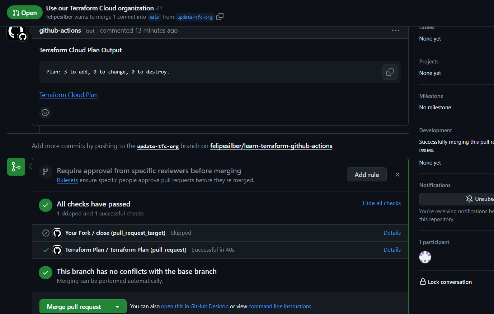
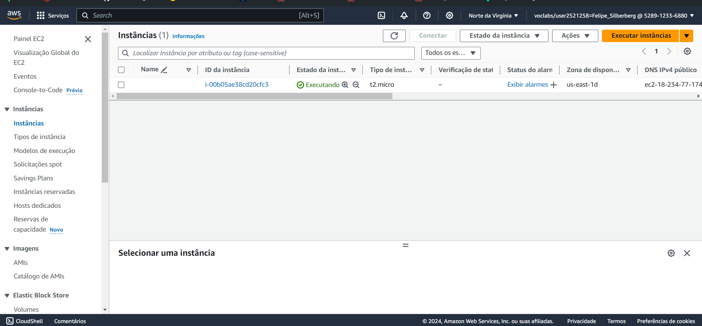

# Ponderada Terraform - Semana 10

## Tecnologia

Terraform é uma ferramenta que permite aos usuários definir e provisionar infraestrutura de TI usando uma linguagem de configuração declarativa. Isso significa que, em vez de gerenciar recursos manualmente ou por meio de scripts imperativos, o Terraform permite que você descreva em código a infraestrutura desejada (como servidores, redes, armazenamentos) de forma abstrata. O Terraform então automaticamente cria, atualiza e gerencia a infraestrutura no provedor de serviços cloud desejado (como AWS), garantindo que o estado da infraestrutura real corresponda ao estado descrito no código. Isso facilita o gerenciamento de infraestruturas complexas, promove práticas de DevOps, permite a integração e entrega contínuas (CI/CD) e melhora significativamente a produtividade, eficiência e a reprodutibilidade dos ambientes de TI.

## Conceitos aprendidos

Durante o desenvolvimento dessa atividade ponderada, foi possível aprender como utilizar a ferramenta Terraform em conjunto com o GitHub Actions. Nesse contexto, o tutorial também passou pela criação automática de uma instância EC2, como consequência da integração entre o Terraform e o GitHub Actions.

## Prints da execução

### GitHub Action com sucesso

### Criação da instância EC2

